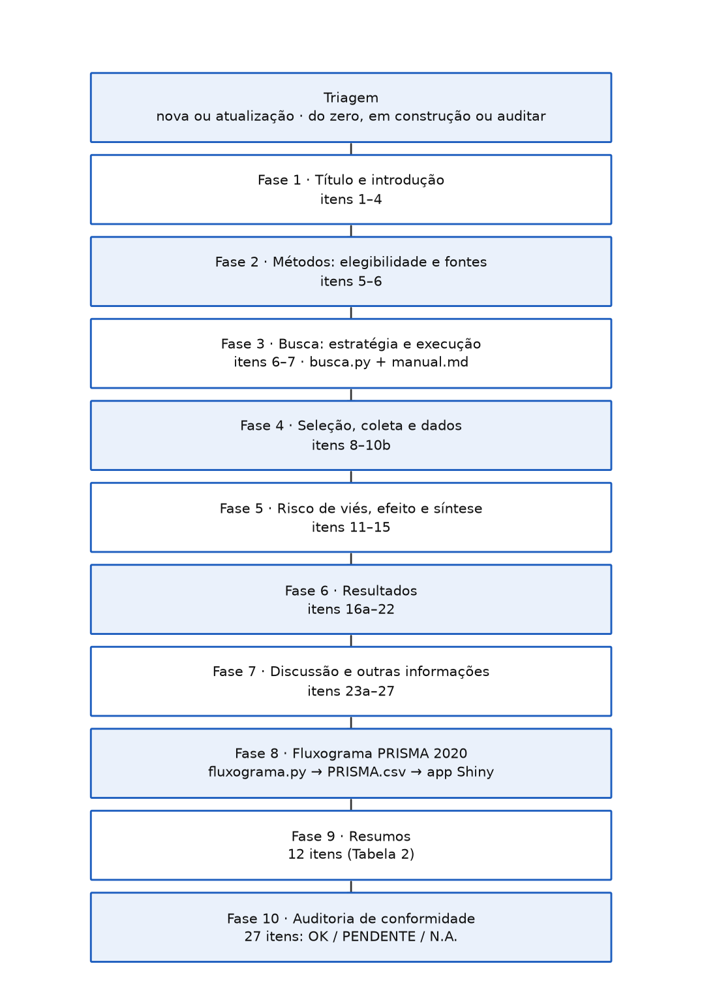
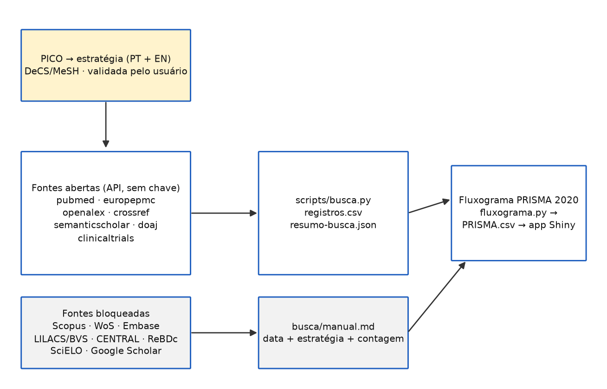
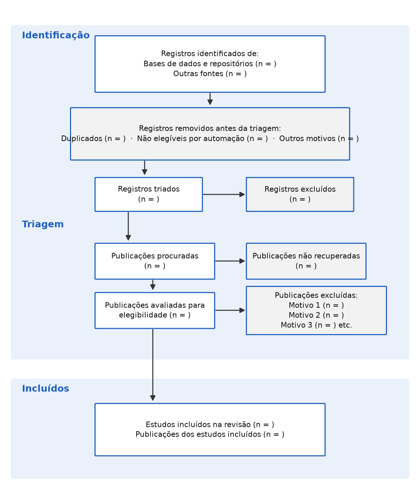

# prisma-br — Skill PRISMA 2020 (pt-BR)

[](LICENSE)
[]
[-8ecae6)](https://www.prisma-statement.org/)
[](https://getmep.shinyapps.io/prisma2020-ptbr/)

Skill de agente (padrão [Agent Skills](https://agentskills.io/specification),
compatível com Command Code) que conduz o **relato** de revisões sistemáticas e
meta-análises **100% conforme a Declaração PRISMA 2020 na tradução oficial em
português brasileiro**:

- fluxo de trabalho em 10 fases, do título à auditoria de conformidade do
  manuscrito;
- lista de checagem de 27 itens (7 seções) e lista de 12 itens para resumos, com a
  redação da tradução oficial;
- **execução de buscas** em APIs acadêmicas abertas (PubMed, Europe PMC, OpenAlex,
  Crossref, Semantic Scholar, DOAJ, ClinicalTrials.gov) — `registros.csv` +
  `resumo-busca.json` como evidência direta dos itens 6 e 16a;
- guia de busca **manual** para fontes sem API pública (Scopus, Web of Science,
  Embase, LILACS/BVS, Cochrane Central, SciELO, Google Scholar, ReBDc), com
  estratégia adaptada por fonte e seção de contexto brasileiro (LILACS×MEDLINE,
  DeCS↔MeSH, produção nacional indexada);
- **fluxograma PRISMA 2020**: confere as somas e exporta `PRISMA.csv` no formato
  exato do app Shiny oficial
  [PRISMA 2020 (pt-BR)](https://getmep.shinyapps.io/prisma2020-ptbr/), que gera a
  figura (PNG/PDF);
- auditoria de conformidade item a item, com status OK / PENDENTE / N.A.

## Visão geral

| Fluxo de trabalho (10 fases) | Módulo de busca |
|---|---|
|  |  |

## Base

Declaração PRISMA 2020, tradução oficial para o português brasileiro:

> Page MJ, McKenzie JE, Bossuyt PM, et al. A declaração PRISMA 2020: diretriz
> atualizada para relatar revisões sistemáticas. *Epidemiologia e Serviços de
> Saúde*. 2022;31(2):e2022107.

Original: Page MJ, et al. The PRISMA 2020 statement: an updated guideline for
reporting systematic reviews. *BMJ*. 2021;372:n71 (CC BY 4.0).

A redação dos itens da lista de checagem, do glossário e do modelo de fluxograma é
da tradução oficial, usada sem parafrasear.

## Instalação

```bash
# pessoal (todos os projetos)
cp -r prisma-br ~/.commandcode/skills/

# ou por projeto
cp -r prisma-br <repo>/.commandcode/skills/
```

Invocação: `/prisma-br [novo | atualizado | auditar]` — ou o agente ativa a skill
sozinho quando a conversa tratar de "revisão sistemática", "meta-análise", "PRISMA",
"fluxograma PRISMA" etc.

Requisito dos scripts: Python 3 (somente biblioteca padrão, sem dependências, sem
chave de API).

## Estrutura

```
prisma-br/
├── SKILL.md                        # fluxo de trabalho (10 fases + regras)
├── references/
│   ├── checklist-27.md             # Tabela 1 — 27 itens (redação oficial)
│   ├── checklist-resumo.md         # Tabela 2 — resumos (12 itens)
│   ├── fluxograma.md               # Figura 1 — modelo, app Shiny, conferências, Mermaid
│   ├── buscas.md                   # fontes abertas vs. manuais, estratégias, contexto BR
│   ├── glossario.md                # Quadro 1 — glossário oficial
│   └── escopo.md                   # escopo, mudanças vs. PRISMA 2009, extensões
├── scripts/
│   ├── busca.py                    # buscas em APIs abertas (stdlib, sem chave)
│   ├── fluxograma.py               # conferência de somas + exportação do PRISMA.csv
│   └── gerar-figuras.py            # (opcional) regenera as imagens do README
└── assets/
    ├── relatorio-modelo.md         # esqueleto do manuscrito por seção/item
    ├── checklist-preenchivel.md    # checklist preenchível (42 linhas)
    └── fluxograma-dados.json       # modelo de contagens do fluxograma
```

## Scripts

### busca.py — buscas nas fontes abertas

```bash
# estratégia única em todas as fontes
python3 scripts/busca.py --query "melatonina AND (câncer OR carcinoma)" --out prisma/busca

# estratégia própria por fonte (arquivo com linhas 'fonte:::estrategia')
python3 scripts/busca.py --query-file prisma/busca/estrategia.txt --out prisma/busca
```

Fontes: `pubmed`, `europepmc`, `openalex`, `crossref`, `semanticscholar`, `doaj`,
`clinicaltrials`. Saída em `prisma/busca/`:

- `registros.csv` — registros únicos (deduplicação por DOI ou título);
- `resumo-busca.json` — data de cada consulta, estratégia, total disponível,
  recuperados, erros, duplicatas removidas. É a evidência para os itens 6 e 16a.

Fontes com API aberta cobrem boa parte da produção nacional (revistas OJS/SEER
registram DOI no Crossref; o OpenAlex indexa SciELO e repositórios
institucionais). Fontes bloqueadas são pesquisadas manualmente pelo usuário com a
estratégia gerada pela skill (`prisma/busca/manual.md`). Sem scraping, sem
contornar bloqueio de acesso.

### fluxograma.py — contagens + PRISMA.csv

```bash
python3 scripts/fluxograma.py --dados prisma/fluxograma-dados.json --out prisma/PRISMA.csv
```

Lê as contagens do JSON (modelo em `assets/fluxograma-dados.json`), **confere as
somas do fluxograma** (triados = identificados − removidos; triados = excluídos +
recuperadas + não recuperadas; avaliadas − excluídas = novos estudos; total =
anteriores + novos; meta-análise ≤ total) e exporta o `PRISMA.csv` no formato do
app Shiny oficial. Se qualquer soma não fechar, o script falha listando os erros —
corrija o JSON e rode de novo.

## Fluxograma no app Shiny



1. Preencher `prisma/fluxograma-dados.json` (cada número com origem:
   `resumo-busca.json`, `manual.md` ou resposta do usuário).
2. Rodar `scripts/fluxograma.py` (conferência + exportação).
3. Subir `prisma/PRISMA.csv` em <https://getmep.shinyapps.io/prisma2020-ptbr/> e
   exportar a figura (PNG/PDF) para `prisma/fluxograma-prisma.png`.

O template do CSV foi validado contra o modelo oficial baixado do próprio app
(colunas `data,node,box,description,boxtext,tooltips,url,n`; 34 linhas de dados;
a única coluna alterada é `n`).

Imagens do README: `python3 scripts/gerar-figuras.py images`
(requer `matplotlib`; apenas para regenerar as figuras).

## Artefatos gerados em `prisma/`

| Arquivo | Origem |
|---------|--------|
| `relatorio.md` | `assets/relatorio-modelo.md` preenchido |
| `checklist-prisma-2020.md` | `assets/checklist-preenchivel.md` preenchido (42 linhas) |
| `busca/estrategia.txt`, `busca/registros.csv`, `busca/resumo-busca.json` | `scripts/busca.py` |
| `busca/manual.md` | busca manual do usuário (template em `references/buscas.md`) |
| `fluxograma-dados.json`, `PRISMA.csv`, `fluxograma-prisma.png` | `scripts/fluxograma.py` + app Shiny |

## Limites

- Diretriz de **relato**, não de condução (limitação declarada pela própria
  declaração).
- PRISMA 2020 não se aplica a protocolos (usar PRISMA-P 2015) nem a avaliar a
  condução de revisões (ROBIS, AMSTAR 2).
- Revisões de tipos especiais (rede, IPD, harms, acurácia, escopo, qualitativa)
  seguem o PRISMA 2020 **+** a extensão correspondente.

## Licença e atribuição

Código e estrutura: [MIT](LICENSE).

- Texto da Declaração PRISMA 2020: tradução oficial (Galvão & Tiguman), publicada
  em *Epidemiologia e Serviços de Saúde* 2022;31(2):e2022107; declaração original
  sob CC BY 4.0 (prisma-statement.org).
- Template do `PRISMA.csv`: app Shiny oficial
  [PRISMA 2020 (pt-BR)](https://getmep.shinyapps.io/prisma2020-ptbr/).
