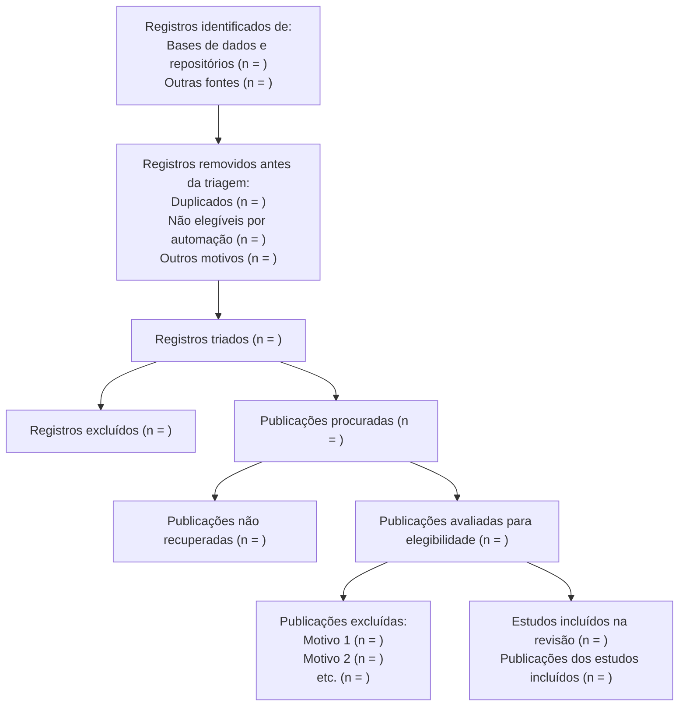
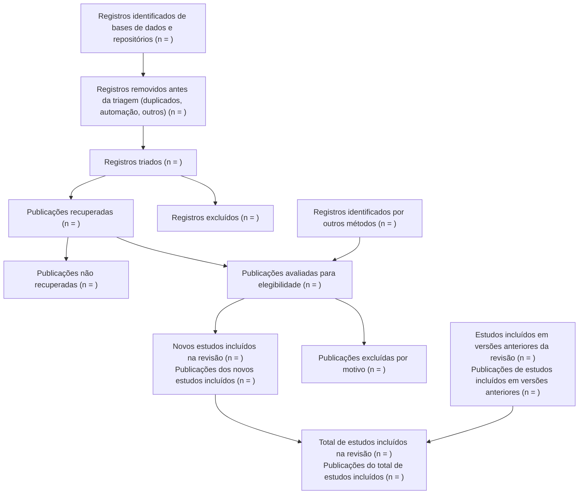

# Figura 1 — Modelo de fluxograma PRISMA 2020

Fonte: Declaração PRISMA 2020 (pt-BR), *Epidemiologia e Serviços de Saúde*
2022;31(2):e2022107, Figura 1. A declaração fornece um único modelo de fluxograma
que pode ser modificado **dependendo de a revisão sistemática ser original ou
atualizada**.

Notas oficiais do modelo:
- (a) Considere, se possível, relatar o número de publicações identificadas em cada
  banco de dados ou repositório pesquisado (em vez do número total em todos os
  bancos de dados/registros).
- (b) Se ferramentas de automação foram usadas, indique quantas publicações foram
  excluídas por pessoas e quantas foram excluídas por ferramentas de automação.
- As caixas em cinza só devem ser preenchidas se aplicáveis; caso contrário, devem
  ser removidas do fluxograma.
- "Publicação" pode ser artigo científico, preprint, resumo de conferência, dados de
  registro de estudo, relatório de estudo clínico, dissertação, manuscrito não
  publicado, relatório governamental ou qualquer outro documento que forneça
  informações relevantes.

## Variante A — Revisão nova (original)

Caixas (remova as não aplicáveis):

```
IDENTIFICAÇÃO
  Registros identificados de:
    - Bases de dados e repositórios (n = )
    - Outras fontes (sites, organizações, buscas por citações etc.) (n = )
  Registros removidos antes da triagem:
    - Duplicados (n = )
    - Marcados como não elegíveis por ferramentas de automação (n = )
    - Removidos por outros motivos (n = )
  Registros triados (n = )
  Registros excluídos (n = )

SELEÇÃO
  Publicações procuradas (n = )
  Publicações não procuradas/não recuperadas (n = )   [se aplicável]
  Publicações avaliadas para elegibilidade (n = )
  Publicações excluídas:
    - Motivo 1 (n = )
    - Motivo 2 (n = )
    - Motivo 3 (n = ) etc.

INCLUSÃO
  Estudos incluídos na revisão (n = )
  Publicações dos estudos incluídos (n = )
```

Template Mermaid (preencher `n = `; remover caixas não aplicáveis):



## Variante B — Atualização de revisão prévia

Figura 1 do PDF oficial (caixas exatas; remover as não aplicáveis):

```
ESTUDOS PRÉVIOS
  Estudos incluídos em versões anteriores da revisão (n = )
  Publicações de estudos incluídos em versões anteriores da revisão (n = )

IDENTIFICAÇÃO DE NOVOS ESTUDOS VIA BASES DE DADOS E REPOSITÓRIOS
  Registros identificados de:
    - Bases de dados (n = )
    - Repositórios de registros (n = )
  Registros removidos antes da triagem:
    - Duplicados (n = )
    - Marcados como não elegíveis por ferramentas de automação (n = )
    - Removidos por outros motivos (n = )
  Registros triados (n = )
  Registros excluídos (n = )
  Publicações recuperadas (n = )
  Publicações não recuperadas (n = )
  Publicações avaliadas para elegibilidade (n = )
  Publicações excluídas:
    - Motivo 1 (n = )
    - Motivo 2 (n = )
    - Motivo 3 (n = ) etc.

IDENTIFICAÇÃO DE NOVOS ESTUDOS POR OUTROS MÉTODOS
  Registros identificados em:
    - Sites (n = )
    - Organizações (n = )
    - Buscas por citações (n = ) etc.
  Publicações recuperadas (n = )
  Publicações não recuperadas (n = )
  Publicações avaliadas para elegibilidade (n = )
  Publicações excluídas:
    - Motivo 1 (n = )
    - Motivo 2 (n = )
    - Motivo 3 (n = ) etc.

INCLUSÃO
  Novos estudos incluídos na revisão (n = )
  Publicações dos novos estudos incluídos (n = )
  Total de estudos incluídos na revisão (n = )
  Publicações do total de estudos incluídos (n = )
```

Template Mermaid:



## App Shiny oficial (pt-BR) — caminho principal

- App: **https://getmep.shinyapps.io/prisma2020-ptbr/**
- O app recebe um `PRISMA.csv` com as contagens e gera a figura (PNG/PDF).
- Fluxo desta skill:
  1. Preencher `prisma/fluxograma-dados.json` (modelo em
     `assets/fluxograma-dados.json`) com as contagens reais.
  2. Rodar `python3 scripts/fluxograma.py --dados prisma/fluxograma-dados.json
     --out prisma/PRISMA.csv`. O script **confere as somas** e só exporta se
     fechar; o formato do CSV é validado contra o template oficial do app
     (colunas `data,node,box,description,boxtext,tooltips,url,n`; a única
     coluna alterada é `n`).
  3. Subir `prisma/PRISMA.csv` no app e exportar a figura para
     `prisma/fluxograma-prisma.png` (ou .pdf). Se o usuário quiser, automatizar
     com a skill `agent-browser` (abrir o app, subir o CSV, baixar a figura).
- Revisão nova: `previous_studies`/`previous_reports` vazios (0) — se o app
  exibir a caixa "Estudos prévios", desmarcá-la no app.
- Caixas de meta-análise (`total_studies_ma`/`total_reports_ma`): preencher só
  se houver subconjunto de estudos na meta-análise.

## Conferência de contagens (obrigatória antes de entregar)

O script `scripts/fluxograma.py` executa estas conferências automaticamente e
recusa a exportação se qualquer soma não fechar. Fórmulas abaixo servem de
referência para o usuário conferir.

Variantes nova:
1. Registros identificados = soma das fontes (item por fonte quando possível — nota (a)).
2. Registros triados = identificados − removidos antes da triagem.
3. Registros excluídos + publicações procuradas = registros triados.
4. Avaliadas para elegibilidade = publicações recuperadas.
5. Estudos incluídos = avaliadas − somas dos motivos de exclusão.

Variante atualização (por ramo — bases de dados e outros métodos — e no total):
1. Registros triados = identificados − removidos antes da triagem.
2. Registros excluídos + publicações procuradas = registros triados.
3. Avaliadas = recuperadas.
4. Novos estudos incluídos = avaliadas − somas dos motivos de exclusão (soma dos dois ramos).
5. Total de estudos incluídos = estudos de versões anteriores + novos incluídos.

Regras:
- Cada motivo de exclusão (etapa de publicação) precisa de contagem própria.
- Se há automação, decomponha as exclusões: por pessoas vs. por automação (nota (b)).
- Contagens vêm de `prisma/busca/resumo-busca.json` (fontes abertas) e
  `prisma/busca/manual.md` (fontes manuais) — nunca estimadas.
- Se qualquer soma não fechar, pare e pergunte ao usuário antes de prosseguir.

## Formato de entrega

Gerar em `prisma/`:
1. `fluxograma-dados.json` — contagens preenchidas (cada número com origem:
   `resumo-busca.json`, `manual.md` ou resposta do usuário).
2. `PRISMA.csv` — exportado por `scripts/fluxograma.py` (conferência OK).
3. `fluxograma-prisma.png` (ou .pdf) — figura exportada do app Shiny.
4. (Opcional, preview) `fluxograma-prisma.md` — título
   "Fluxograma PRISMA 2020 — [título da revisão] — [nova | atualização]",
   tabela de contagens + template Mermaid preenchido.
